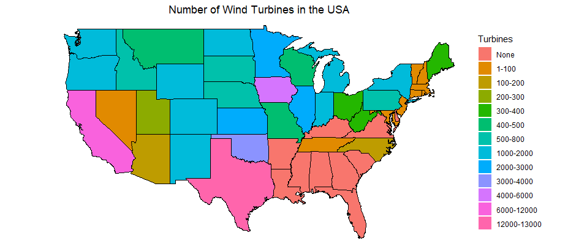

# Set Working Directory
setwd("~/Makeover-Monday/visualization-challenge-2-maxzav17")

# Bring in data
all <- read.csv(file = "US-State-Wind-Energy-Facts-2018.csv")
census <- read.csv(file = "Census.csv", header = T, sep = ",")

# Load Packages
library(ggplot2)
library(Rmisc)
library(ggpubr)
library(gridExtra)
library(gridbase)
library(ggmap)
library(maps)
library(mapdata)
library(dplyr)
library(waffle)
library(RColorBrewer)
library(ggsci)

# Rename Columns
names(all) <- c("Rank", "State","Capacity","Homes","Investment","Projects","Number")

# Remove axis ticks

ticks <- theme(axis.text = element_blank(), axis.line = element_blank(), axis.ticks = element_blank(), panel.border = element_blank(), panel.grid = element_blank(), axis.title = element_blank())

# Make USA Map
usa <- map_data("usa")
state <- map_data("state")

all$region <- tolower(all$State)

# Join both data frames
state_all <- inner_join(state, all , by = c("region" ="region"))

# Base USA map
ggplot() + geom_polygon(data = usa, aes(x=long, y=lat, group = group)) + coord_fixed(1.3)

# state map
map <- ggplot(data = state_all) + geom_polygon(aes(x = long, y = lat, fill = State, group = group), color = "white") + coord_fixed(1.3) + guides(fill=FALSE)

# number of windmills
base <- ggplot(data = state_all, mapping = aes(x = long, y = lat, group = group)) + coord_fixed(1.3) + geom_polygon(color = "black", fill = "grey")
base

# add windmill layer to base map
number <- base + geom_polygon(data = state_all, aes(fill = as.numeric(Number)), color = "white") + geom_polygon(color = "black", fill = NA) + theme_bw() + scale_fill_gradient(trans = "log10", guide = guide_colorbar(title.position = "top")) + theme(legend.title = element_text (), legend.key.width = unit(0.5, "in")) + labs(fill = "Number of Wind Turbines") + ticks +ggtitle("Number of Wind Turbines in the USA")
number

# make Bin
state_all$Turbines <- cut(as.numeric(state_all$Number), breaks = c(0, 1, 100, 200, 300, 400, 500, 800, 1000,2000,3000,4000,6000,12000,13000), labels=c("None","1-100","100-200", "200-300", "300-400","400-500","500-800","800-1000" ,"1000-2000","2000-3000","3000-4000","4000-6000","6000-12000","12000-13000"), include.lowest = T)

# Add Bins
B <- base + geom_polygon(data = state_all, aes(fill = Turbines, x = long, y = lat, group = group)) +
  theme_void()+scale_colour_manual(values = c("#999999","#56B4E9","#009E73","#F0E442","#0072B2","#D55","#00FF33","#660OCC","#0000FF","#CC6600","#CC3399","#FFCC00","#CCCC33","#FF6CC"))

# Final Map
M <- B + geom_polygon(data = state, aes(x=long, y=lat, group = group), fill =NA, color = "black") + coord_fixed(1.3) + ggtitle("Number of Wind Turbines in the USA") + theme(plot.title = element_text(hjust = 0.5))
M

# subset data:
new <- all[which(all$Rank <= 10),]

# Graph Homes Powered
H <- ggplot(new, aes(x= Rank, y = Homes, color = State)) + geom_bar(stat = "identity") + theme(axis.text.x=element_text(angle = 50, size = 15, vjust = 0.5)) + scale_x_continuous(breaks = round(seq(min(new$Rank), max(new$Rank), by = 1),1), name = "State",labels=c("Texas", "Oklahoma","Iowa","California","Kansas","Illinois","Minnesota","Oregon","Colorado","Washington")) + theme(axis.line = element_line(colour = "black", size = 1, linetype = "solid")) + theme(axis.ticks = element_blank()) + theme(legend.position = "none")+ theme(panel.grid.major = element_blank(), panel.grid.minor = element_blank(), panel.background = element_blank()) + labs(y = "Equivelant Homes Powered") + ggtitle("Homes Powered") + theme(plot.title = element_text(hjust = 0.5))+scale_fill_manual(values=c("#FF6666"))

# Capacity
C <- ggplot(new, aes(x= Rank, y = Capacity, color = State)) + geom_bar(stat = "identity") + theme(axis.text.x=element_text(angle = 50, size = 15, vjust = 0.5)) + scale_x_continuous(breaks = round(seq(min(new$Rank), max(new$Rank), by = 1),1), name = "State",labels=c("Texas", "Oklahoma","Iowa","California","Kansas","Illinois","Minnesota","Oregon","Colorado","Washington")) + theme(axis.line = element_line(colour = "black", size = 1, linetype = "solid")) + theme(axis.ticks = element_blank()) + theme(legend.position = "none")+ theme(panel.grid.major = element_blank(), panel.grid.minor = element_blank(), panel.background = element_blank()) + labs(y = "Installed Capacity (MW)") + ggtitle("Electrical Capacity") + theme(plot.title = element_text(hjust = 0.5))+scale_fill_manual(values=c("#FF6666"))

# Make one Image

layout <- rbind(c(1,1,1,1,1,1), c(1,1,1,1,1,1),c(1,1,1,1,1,1),c(1,1,1,1,1,1),c(2,2,2,3,3,3), c(2,2,2,3,3,3), c(2,2,2,3,3,3), c(2,2,2,3,3,3))

grid.arrange(M,H,C, layout_matrix = layout)

# Make Waffle Chart

parts <- c('Connecticut (9)' = 9, 'Maine (1800)' = 1800,'Massachusetts (236)' = 236, 'New Hampshire (375)' = 375, 'Rhode Island (346) ' = 346, 'Vermont (300)' =300)

W <- waffle(parts / 3, rows = 25, size = 0.5, title = "Wind Energy Investment In New England ($ Millions)", xlab = "1 square = $ 3,000,000", pad = 8)

